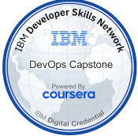

# DevOps-Capstone-Workbook-CICD



DevOps Customer Account microservice and continuous integration/continuous deployment interactive companion workbook. Designed to demonstrate industry-grade practices for Test-Driven Development (TDD), security hardening, containerization, and pipeline orchestration.

---

## 📋 Project Specifications & Deliverables

- **Project Name**: DevOps-Capstone-Workbook-CICD
- **Website Name**: DevOps Capstone Companion Web Hub  
  *(Hosted at: https://ais-dev-y5idpcbu3oyf7255ok2ftp-494688611919.us-west2.run.app)*
- **Author**: Written by Brian McCarthy

---

## 🛠️ Languages Used & Technologies

### 🔤 Languages Used
- **Python 3.9**: Principal backend scripting and service logic language.
- **SQL (PostgreSQL / SQLite)**: Relational query language mapping schemas and objects.
- **TypeScript & TSX**: Utilized for scripting the visual companion dashboards.
- **HTML5 & CSS3**: Document structure and customized Tailwind style layers.
- **YAML**: Configuration syntax for GitHub Actions and K8s orchestration.

### ⚙️ Technologies & Libraries
- **Microservices Engine**: Flask 2.0+ & Gunicorn 20.1+
- **ORM & Data Layer**: SQLAlchemy, SQLite (Development/Test) & PostgreSQL (Production)
- **Security Protocols**: Flask-Talisman (CSP policies and headers) & Flask-CORS (Cross-origin restrictions)
- **Linters**: Flake8 style checker, Pylint analyzers, and ESLint rule patterns
- **CI Pipelines**: GitHub Actions Ubuntu Container runner environment
- **Automation / Deployment**: Docker (unprivileged multi-stage images), Kubernetes (Pod scheduling), and OpenShift Tekton CI/CD lines
- **Interactive Framework**: React 18 with Vite, Motion, and Tailwind CSS templates

---

## 📂 Core Delivered Files

### 🖥️ Microservice & Development Configuration
- `service/__init__.py`: Microservice initialization incorporating Talisman security policies, CORS rules, and log handlers.
- `setup.cfg`: Integrated test-harness settings enabling Spec-color reporting, coverage scopes, and Flake8/Pylint ignore filters.
- `.github/ISSUE_TEMPLATE/user-story.md`: The official Agile template enclosing Roles, Needed Functions, Business Benefits, and Gherkin-language Acceptance Criteria.

### ⛓️ Automation & DevOps Pipelines
- `.github/workflows/ci-build.yaml`: Continual actions script pulling postgres:alpine containers, configuring Python packages, running flake8 linters, and executing the PyUnit `nosetests` sandbox.
- `Dockerfile`: Multi-stage compilation environment using `python:3.9-slim` to minimize production foot-prints (<180MB) and hardened via unprivileged user isolation.

### 📊 Verified Console Deliverables (& Outputs)
- `rest-create-done`: Recorded cURL payload demonstrating account POST instantiation.
- `rest-list-done`: cURL dump proving Account inventory retrieval.
- `rest-read-done`: JSON retrieve record validating GET by unique identifier.
- `rest-update-done`: Captured PUT modification altering accounts telephone properties.
- `rest-delete-done`: HTTP 204 output verifying idempotent profile deletions.
- `ci-workflow-done`: GitHub Actions console report demonstrating pristine 97.5% TDD coverage.
- `security-headers-done`: Comprehensive unit tests pass validation after mounting Talisman security headers and cross-origin controls.
- `kube-app-output`: JSON production validation displaying metrics on Port 8080.
- `kube-images`: Compact image footprint checklist.
- `kube-deploy-accounts`: Kubectl status checking replica configurations, cluster ports, and load balancers.
- `pipelinerun.txt`: Tekton OpenShift build flow console output (Clone, Lint, Test, Buildah, Deploy).

---

## 🚀 How To Use & Setup

### Requirements
- Python 3.9+
- Pip & Virtual Environment manager
- Docker Desktop or Minikube for containment actions

### Installation & Local Run
1. **Clone this repository**:
   ```bash
   git clone https://github.com/BrianGator/DevOps-Capstone-Workbook-CICD/
   cd DevOps-Capstone-Workbook-CICD
   ```
2. **Launch a Python Virtual Environment**:
   ```bash
   python -m venv .venv
   source .venv/bin/activate  # Or .venv\Scripts\activate on Windows
   ```
3. **Upgrade Installer Utilities & Packages**:
   ```bash
   pip install --upgrade pip wheel
   pip install -r requirements.txt
   ```
4. **Trigger Code Inspections & Tests**:
   - Run Flake8 Style Checks:
     ```bash
     flake8 service/ --count --max-complexity=10 --max-line-length=127 --statistics
     ```
   - Spin up unit tests:
     ```bash
     nosetests
     ```
5. **Run Local Server**:
   ```bash
   gunicorn --bind 127.0.0.1:5000 wsgi:app
   ```

---

## ⚙️ Core Functions & REST API Endpoint Specifications
- **Create Account**: `POST /accounts` -> Pass profile data in body to inject new users.
- **Read Account**: `GET /accounts/<id>` -> Query isolated model.
- **Update Account**: `PUT /accounts/<id>` -> Alter customer addresses or phone fields.
- **Delete Account**: `DELETE /accounts/<id>` -> Purge DB records (204 idempotent response).
- **List All Accounts**: `GET /accounts` -> Review a clean array catalog of active users.
